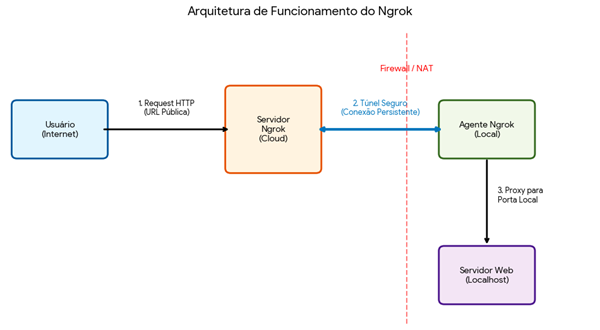

# Ambiente de Estudo N8N (Docker Desktop)


Este repositório contém a infraestrutura necessária para subir um ambiente completo de automação com n8n, utilizando PostgreSQL como banco de dados principal e Redis para gerenciamento de filas (Queue Mode).

## 🚀 Estrutura do Projeto

O ambiente é composto pelos seguintes serviços:

* n8n: Ferramenta de automação baseada em nós.
* PostgreSQL: Banco de dados relacional para persistência de dados.
* Redis: Utilizado para otimizar a performance via queue mode.

## 🛠️ Pré-requisitos

* Docker Desktop instalado (Windows 11 recomendado).
* WSL2 configurado e atualizado.

## ⚙️ Configuração Inicial

Antes de subir os containers, você deve configurar suas variáveis de ambiente:

* Renomeie o arquivo .env-TEMPLATE para .env.
* Edite o arquivo .env e substitua as informações de exemplo pelas credenciais do seu projeto:
  * N8N_USER e N8N_PASSWORD: Credenciais para acesso ao painel do n8n.
  * POSTGRES_DB, POSTGRES_USER e POSTGRES_PASSWORD: Dados de conexão para o banco de dados.

> [!WARNING]
Nunca realize o commit do arquivo .env no Git. Utilize senhas fortes contendo letras, números e símbolos.

## 📦 Como rodar

Com o terminal aberto na pasta raiz do projeto, execute os comandos abaixo na sequência:

### PowerShell

1. Construir a imagem customizada

```sh
docker-compose build --no-cache
```

2. Subir os serviços em segundo plano

```sh
docker-compose up -d
```

## 💡Dicas

O container oficial do N8N roda em Aphine (Linux), mas não trás algumas ferramentas importantes e que podem ser necessárias para o dia a dia de quem cria e gerencia automações pelo N8N. Abaixo algumas dessas ferramentas e como elas são instaladas no container. Lembrando que, nesse caso, não há modificações na imagem que mantive a oficial. Foi uma decisão para não dar complexidade ao ambiente e não customizar.

### APK (instalador de ferramentas oficial do Alphine)

1. Busque pela arquitetura correta da distribuição

   ```html
   http://dl-cdn.alpinelinux.org/alpine/latest-stable/main/
   ```

   No meu caso usei a x86_64, que deve ser a padrão.

   ```html
   http://dl-cdn.alpinelinux.org/alpine/latest-stable/main/x86_64/
   ```

2. Procure pelo arquivo "apk-tools-static-*", isso vai mudar conforme a versão que você for utilizar. Abaixo dei o exemplo corrente nesse momento. Após verificar a versão, modifique o nome do arquivo e use o comando WGET para baixá-lo no seu container.

   ```sh
   wget "http://dl-cdn.alpinelinux.org/alpine/latest-stable/main/x86_64/apk-tools-static-3.0.
   4-r0.apk"
   ```

3. Descompacte o arquivo baixado em uma pasta, sugestão criar uma pasta downloads em home (mkdir home/downloads), entrar na pasta (cd home/downloads) e rodar o comando:

   ```sh
   tar -xzf apk-tools-static-3.0.4-r0.apk
   ```

4. Agora você consegue rodar o arquivo local e instalar o APK. A partir disso você passa a ter o gerenciador de pacotes APK instalado e consegue, por ele, fazer as instalações de outras ferramentas que necessitar.

   ```sh
   ./apk.static -X http://dl-cdn.alpinelinux.org/alpine/v3.22/main -U --allow-untrusted --initdb add apk-tools
   ```

### 🐍 Instalando o Python

Comando simples do APK para instalação do Python.

```sh
apk add --no-cache python3 py3-pip
```

> [!IMPORTANT]
Não é possível instalar diretamente as bibliotecas Python usando pip (ou pip3), isso pode ser feito somente via APK dessa forma:

```sh
apk add py3-NOME_BIBLIOTECA
```

Exemplo:

```sh
apk add py3-requests
```

### Instalando o NPM

Outra ferramenta importante para o N8N é o NPM, um gestor de pacotes utilizados para subir os COMMUNITY NODES. Fazendo essa instalação você pode instalar os pacotes (NPM) tanto pela interface do N8N, quanto pelo terminal. A sugestão é sempre fazer isso pela interface. Para instalar o NPM use o comando:

```sh
apk add npm
```

### 🐏Ollama

Ollama é um sistema que facilita o uso de modelos (LLM) de código aberto (Gemma, DeepSeek, Mistral, Llama, entre outros.) em ambiente local e offline. Nesse ambiente que criei ele é interessante por ser muito versátil quando aos modelos disponíveis, por ser FREE (os modelos são opensource) e rodar localmente. Duas formas que você pode usar:

1. Instalando o Ollama Desktop, onde você tem uma interface de chat, configurações e download de modelos, que também disponibiliza um servidor que pode ser acessado localmente (USEI NESSE MODELO);
2. Usar um container do Ollama no Docker com a imagem oficial.

Ambas as formas são tranquilas de se fazer, a dica aqui é que se você for usar o Ollama desktop vai perceber que a URL de acesso para ele no seu ambiente é:

```sh
http://localhost:11434
```

Mas para que você use ele (Ollama) no N8N você vai precisar usar a URL fornecida pelo Docker Desktop que é:

```sh
http://host.docker.internal:11434
```

Isso deve ser configurado no nó (node) Ollama em seu fluxo de trabalho.

### NGROK

Algo que descobri no meio do caminho: alguns serviços precisam de um acesso a partir de um domínio público e seguro (SSL) para funcionar. Como exemplo o Telegram, o Whatsapp, o GMail, e etc. Como estamos num ambiente local (localhost) isso não existe. Uma forma, fácil, de passar por essa etapa é usar um serviço chamado NGROK (https://ngrok.com/). Ele é, ainda, um serviço gratuíto que gera domínios não personalizados (ele gera a sua URL aleatoriamente com nomes estranhos) e redireciona as requisições feitas com esse domínio criado para o seu servidor local.



Quais são os passos para você utilizá-lo?

1) Crie uma conta em https://ngrok.com/
2) Ele vai gerar o seu "Your Authtoken", isso fica no menu Your Authtoken (fácil). Lembre-se dessa informação;
3) Gere seu domínio. Também lembre-se dessa informação que fica no menu Domains, ela vai ser importante tanto agora na configuração quanto no seu dia a dia;
4) Vá no Docker Desktop, no menu Extensions/Manager e busque por "ngrok". Ali teremos uma extensão oficial que vai facilitar nosso trabalho.
5) Após instalar a extensão vá no ícone de engrenagem e na janela que abriu cole seu TOKEN e sua URL nos campos correspondentes (pedi para lembrar deles).
6) Agora deve aparecer o seu container do N8N, ative o ENDPOINT e acesse a SUA URL PERSONALIZADA. Aqui uma atenção, o NGROK mostra uma tela inicial. Basta clicar em "Visit Site" para ele redirecionar para o seu N8N local.

> [!IMPORTANT]
   Eu fiz tudo isso e não funcionou de primeira (oi?). Precisei alterar duas variáveis de ambiente:

   ```sh
   N8N_EDITOR_BASE_URL
   WEBHOOK_URL
   ```

   Após alteradas tive que recriar o container para que funcionasse. Eis um dos mistérios da TI, algo que era para funcionar não funcionou. E por não estar com tempo não fiz um novo teste do zero. Então, fica a dica caso as coisas não funcionem de primeira. Os arquivos estão atualizados e basta você preencher como eu fiz. Estou colocando isso aqui porque alguém pode passar pelo que eu passei e dou o caminho das pedras.

## 📋 Informações Técnicas

* Persistência: Foram configurados volumes locais nomeados (n8n_data, postgres_data, redis_data) para garantir que seus fluxos e dados não sejam perdidos ao reiniciar os containers.
* Performance: O ambiente já conta com limites de CPU e Memória definidos para evitar travamentos no Docker Desktop.
* Modo de Execução: Configurado por padrão em queue mode para suportar maior volume de execuções simultâneas.
